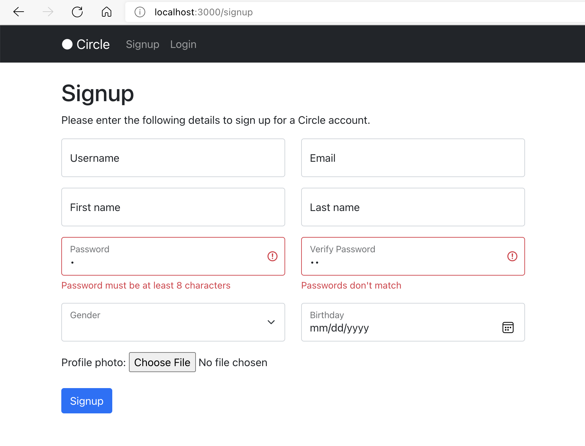
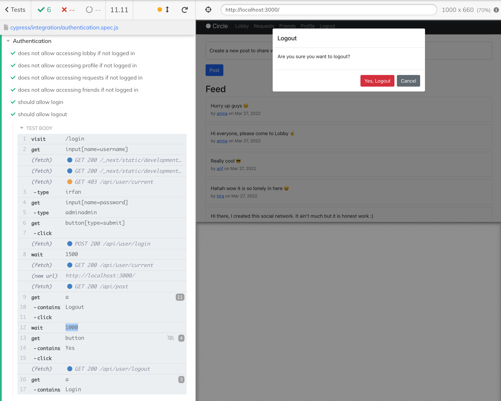

# Advanced Web Development - Final Project

## Introduction

This report explains the course work project and discusses the tools and techniques used and how to get the application running.

## Tools

The backend is built with **Django**, a backend focused web framework written in Python. Django has advanced set of tools for designing backend APIs including routing, Models, ORM, Database auto migrations and more. I used Django Rest Framework for API endpoints.

In order for the chat functionality to work, a **Redis** server must be running on localhost at port 6379. This may be configured at `/backend/settings.py`.

Even though Django supports frontend views as well through its powerful templating mechanism, I opted for **Next.js** as the frontend framework because it enables us to develop highly interactive single page applications.

Next.js is built on top of other powerful JavaScript technologies including React.js, Express.js and Webpack. This enables it to perform server-side rendering of React.js components and pages, file and directory-based routing, code-splitting as well built-in support for REST API even though we haven’t used this last feature.

As mentioned above, Next.js is based **React.js** which is an open-source frontend framework built by Facebook and it provides an ingenious way to mix up frontend layout structures along with the related JavaScript logic into components using a special syntax called JSX. You can think of it like HTML that is written inside JavaScript files. These React.js components help keep the frontend code cleanly organized because all the relevant logic resides directly along with the relevant UI markup.

## Directory and code structure

The application code is organized as a monorepo i.e. a single Git repository constaining both frontend and backend applications.

| Module  | Directory   |
| ------- | ----------- |
| Django  | `final/backend`  |
| Next.js | `final/frontend` |

The Django project itself further contains separate sites for:

- A REST API application located at `/backend/app`. This contains API routes `/app/api/*` handling most of the application logic.
- A chat Websocket application handing realtime communication between users. This is located at `/backend/chat`.
- The Django project as whole is defined and configured at `/backend/backend`

The frontend Next.js application is a Node.js application so its scripts and dependencies are listed at `/frontned/package.json` and application configurations such as how frontend requests to backend API are rerouted to backend are located in Next.js configuration file at `/frontend/next.config.js`.

## How to run the application?

To run the whole application, we need to separately run Django backend, a Redis server and the Next.js frontend.

### Django

In development we can use the development server built into Django. But first we need to ensure Python 3 is installed and working. To check, please run the following in your terminal:

```bash
python3 --version
```

It is also recommended to use Python virtual environment to install the Django dependencies. Please follow [https://docs.python.org/3/library/venv.html](https://docs.python.org/3/library/venv.html).

Navigate to `/final/backend` and install Django dependencies:

```bash
pip3 install -r requirements.txt
```

Run the Django development server:

```bash
python3 manage.py runserver
```

Run a Redis server at port 6379 on localhost. If you have Docker installed, you can run Redis via Docker via the following command in terminal:

```bash
docker run -p 6379:6379 redis
```

To run redis locally without Docker, please follow [this guide](https://redis.io/topics/quickstart).

```bash
python3 manage.py createsuperuser
```

### Next.js

Now that we have the backend running, we can turn our attention to the frontend app. Please keep the Django application running and open a new terminal instance and navigate to `/final/frontend`

To be able to run the frontend, we need have Node.js installed. To check, please run

```bash
node -v
```

If not installed, please install it from here [from here](https://nodejs.org/en/download/).

Restart the terminal, navigate to `/final/frontend` and then run:

```bash
npm i
```

This will install the Node.js packages needed to run the frontend application. Now we can run the frontend development server:

```bash
npm run dev
```

## Test data

The included sqlite database has the following users that maybe used to test the app.

| Username  | Password   | Type |
| ------- | ----------- | --
| admin  | admin  | superuser
| irfan | adminadmin 
| hira | adminadmin
| amna | adminadmin
| arif | adminadmin

The first user `admin` may be used to login to Django admin via URL: `http://localhost:8000/admin` to view the contents in the database and make quite modifications.

## Models and data structure

The core backend models and API is defined in `backend/app`.

Since the Django framework has the `User` model built in, I decided to use that initially to gain experience and if the doesn't fullfil my needs, I planned to use my own model. However it worked pretty well except that it doesn't come with fields such as user's friends, and user's profile picture etc. For that I created `Profile` model which I linked to the `User` model via a `OneToOneField`. This is the Django recommended way. When the user signs up, I collect as much user info as possible and populate both User and the linked Profile.

I have the following fields on `Profile`:

- `user`: `OneToOneField` links `Profile` to `User`
- `avatar`: `ImageField` to store the details such as location on storage of the user's profile picture
- `friends`: `ManyToManyField` relates users' profile to other users's profiles, meaning that they are friends
- `birthday`: `DateField` date of birth of the user
- `gender`: `CharField` stores the gender of the user e.g. F, M etc. I use an object that maps the values in the database to user friendly works such as `Female`, `Male` etc.

In order to facilitate the users to add friends on the network, I created a model `FriendRequest` which allows the users to send someone a friend request and the receiving person is then able to accept if they wish. Upon accepting, the `FriendRequest` itself is deleted, however the two people are registered as friends with each other. The `FriendRequest` model has the following fields:

- `receiver`: `ForeignKey` links to `User` recieving the request
- `sender`: `ForeignKey` links to `user` sending the request

Finally, I have `Post` model which lets the users post status updates. Currently I don't have ability to attach images to status updates but I plan to do that later. `Post` is related to `User` via a foreign key because each user can have multiple posts. Fields on `Post` model:

- `body`: `TextField` main text content of the post
- `created_at`: `DateTimeField` to record the timestamp when the post was created
- `updated_at`: `DateTimeField` to record the timestamp wehn the post was last updated, however currently Post editing isn't supported
- `user`: `ForeignKey` to link the post to User. Multiple posts may be created by a sinlge user.

## REST API and other endpoints

Most of the API endpoints are defined in `backend/app/urls.py`. Most of the views return data as JSON and are build with Django Rest Framework (DRF). I have extensively utilized classed based views that extend DRF's generics.

| Endpoint | HTTP Methods | Description |
| ----| --- | --- |
| `api/user` | POST | Creates user |
| `api/user/login` | POST | Creates a new session |
| `api/user/logout` | GET | Deletes session of the current user |
| `api/user/current` | GET | Returns the current authenticated user along with their profile. This returns detail info about the user and their profile except the password hash. |
| `api/user/<int:id>` | GET | Returns the user by the `id` provided. This returns limited information unless the requested person is friends with the user |
| `api/user/<int:id>/unfriend` | PATCH | Removes the user from list of friends of the current user |
| `api/user/<int:id>/posts` | POST | Returns a list of posts created by the given user ordered most recent first. Returns permission denied if the user is not self or a freind of the requesting user. |
| `api/user/<str:search_text>` | GET | Returns a list of users and their profiles whoes usernames match the given `search_text`. This returns limited information. |
| `api/request` | POST | Creates a new friend request, automactically registering the current user as the `sender`. |
| `api/request/<int:id>/accept` | DELETE | Deletes the friend request and registers `sender` and the `receiver` as each other's friends. |
| `api/request/<int:id>/reject` | DELETE | Deletes the friend request and does nothing else i.e. doesn't add the two people as each other's friends. |
| `api/post` | POST, GET | If method is POST, creates a new post and registers current user as foreign key. If method is GET, returns all the posts created by the requesting user or their friends, ordered most recent first. |

## Form handling and AJAX

Being a single page application (SPA), the forms and other actions are submitted via AJAX as `application/json` in most cases, except where complex data such as files are submitted along with other info, in which case I submit the form as `multipart/form-data`.

In the frontend, the forms are handled using an excellent React.js library called [Formik](https://formik.org/). Since Next.js itself is built on top on React.js, we can use Formik with Next.js as well. Formik simplifies React.js forms because it encapsultes the form state and simplifies JSX syntax of the forms dramatcially compared to raw React.js forms by using a React.js feature called [Context](https://reactjs.org/docs/context.html).

I have a custom `FormikInput` component at location `frontend/components` and in there I get the form input's `onChange` handlers and other details using a React hook called `useField`. This component then simply from the React context knows the form it is included in and lets the formik handle it state using `name` prop.

Formik then calls appropriate methods I passdd into `useFormik` hook e.g. `onSubmit` based on user actions.

For forms that allow upload of files such the signup for which allows attaching a profile picture, because we have binary data, I transform the JavaScript object given to me by Formik into a `FormData` object that emulates the trandistional HTML forms and allows sending of the binary data.

For doing the API calls (not just forms submission but AJAX calls in general), I have used custom methods `fetcher` and `fetcherSwr` located in `frontend/utils`. The latter is used with [SWR](https://swr.vercel.app/) a library that implements "stale while revalidate" pattern i.e. we display the cached values to the user while we refetch the fresh data. Please see `frontend/pages/index.tsx` for an example.

### Validation

Validation is performed both in the backend by Django and the Django Rest FrameWork and also in the fronedend using Formik.

The frontend validation improves the user experience a lot. On the frontend, I pass in a validation method to `useFormik` that is then called by Formik on every change in user input. I designed the `FormikInput` component I discussed above, in such a way that it gets any validation error from Fromik through `useField` and then displays the error using Bootstrap (Reactstrap) error message component that styles these validation messages nicely.

Since the user receives instant feedback about whether the form is valid or invalid, it saves them the hassle of submitting an invalid form only to find out after page reload that the form is invalid. One downside of this approach is that there may be a mismatch between the frontend and backend validation rules. However the benefit far outweighs the disadvantages.

Here is a simple example of login page form handling:

```ts
// frontend/pages/login.tsx
export default function Login() {
  // ... other code ...

  const formik = useFormik<{
    username: string;
    password: string;
  }>({
    initialValues: {
      username: "",
      password: "",
    },
    onSubmit: async (values) => {
        // form submission logic
    },
    validate: (values) => {
      const errors: FormikErrors<typeof values> = {};
      if (!values.username) {
        errors.username = "Username is required";
      }
      if (!values.password) {
        errors.password = "Password is required";
      }
      return errors;
    },
  });
  // ... other code ...
  return (
    <>
      <h1>Login</h1>
      <p>Please enter your credentials to login.</p>
      <FormikProvider value={formik}>
        <Form>
          <FormikInput name="username" label="Username" />
          <FormikInput type="password" name="password" label="Password" />
          <Button type="submit" color="primary" disabled={!formik.isValid || formik.isSubmitting}>
            Login {formik.isSubmitting && <Spinner size="sm" color="light" />}
          </Button>
          {formFeedback && (
            <p className={`text-${formFeedback.accent} mt-3`}>
              {formFeedback.message}
            </p>
          )}
        </Form>
      </FormikProvider>
    </>
  );
}
```

```ts
// frontend/components/FormikInput.tsx
export function FormikInput(props: Props) {
  const { label, name, type, options, ...otherProps } = props;
  const [{ value, ...field }, meta] = useField(name);

  const invalid = meta.touched && meta.error;
  return (
    <FormGroup floating>
      <Input
        type={type ?? 'text'}
        invalid={!!invalid}
        value={value ?? ''}
        placeholder={label}
        {...field}
        {...otherProps}
      />
      <Label>{label}</Label>
      {invalid && <FormFeedback>{meta.error}</FormFeedback>}
    </FormGroup>
  );
}
```

Here is a screenshot of frontend form validation:



## Authentication

Initially I used Json Web Token (JWT) authentication based on [Simple JWT](https://django-rest-framework-simplejwt.readthedocs.io/en/latest/) and it worked pretty well except that I had to set the token in the request header. However, later I found out that Django channels doesn't populate the user in `request.scope` with token authentication. Instead it only supports Django's built-in session authentication. So I decided to replace JWT with Django session authentication. With SSL / HTTPS, session authentication should be pretty safe. Once drawback of using session auth. is that the server has to store all the sessions that have been created, where as in token based authentication the server creates the login token and then token itself can be verified for authenticity because it is encrypted using the private key of the issuer and anyone can read using the public key of the issuer. But no one can fake it because private key of the issue is needed to create one.

While, I could have embeded the user details within the stringified message sent via websockets, giving frontend that much control is not considered secure and obtaining the user from the request scope is way more safe because then it is difficult for a user to disguise themselve as being another user sending the message.

## Frontend navigation, layout and authentication

On the frontend, Next.js handles the rounting between pages beautifully. It has this concept of pages that reside at `frontend/pages` and Next.js scans this directory on app startup and registers routes based on the file and folder structures. It looks for default exported JSX components and treats them as pages. So if we have such a component located at `frontend/pages/login.tsx` it will be accessible as a page at relative URL of `/login`. Next.js also supports [dynamic routes](https://nextjs.org/docs/routing/dynamic-routes) which I have used for Profile page.

We have the following routes / pages:

- [Home](http://localhost:3000)
- [Login](http://localhost:3000/login)
- [Signup](http://localhost:3000/signup)
- [Profile](http://localhost:3000/profile/{id})
- [Friends](http://localhost:3000/friends)
- [Requests](http://localhost:3000/requests)
- [Lobby](http://localhost:3000/lobby)

On the frontend, the session cookie is set automatically by the browser. However I do need to let all the pages in the app know whether the user is authenticated and a valid session exists. To do that, I have relied on [React Context](https://reactjs.org/docs/context.html) to share the user session state throughtout app. This is done in `frontend/pages/_app.tsx` where I have used a custom hook `useSession`, this hooks provides us the `user` object and `updateSession()` and `logout()` methods which may be called from anywhere in the application e.g. upon login and logout (please see `frontend/pages/login.tsx` and `frontend/components/Navbar.tsx`) to let the app update the user object with fresh data from server. This is then instantly made available throught the frontend app.

For the UI, I used a React.js library [Reactstrap](https://reactstrap.github.io/) for the popular [Bootstrap](https://getbootstrap.com/) library. The Bootstrap styles are compiled on the fly using [Sass](https://sass-lang.com/). Even though I didn't yet customize the look and feel, we can easilty do so by overriding the default bootstrap Sass variables. More details [here](https://getbootstrap.com/docs/5.0/customize/sass/).

## Data access control

Another thing I had to really be careful about is control over what data is visiable and modifiable for users. Since this is a social network, data belonging to many many users is stored in the same database tables so any REST endpoints that we create must not only require the users to be logged and authenticated but also, that they be only allowed to access the information they are meant to access and nothing else. For example, in this simple social network, a user should be able to see their own posts but not those posted by others unless they are friends.

To do that, I used different serializers e.g. `UserSerializer` for detailed information about the given user and their profile and `UserSerializerRestricted` for basic information e.g. when someone is not a friend with someone and their profile comes up in search results, we need to limited the information visible to protect the privacy of the user. Currently my serializers are not based on each other i.e. UserSerializer doesn't "extend" or inherit from the other. Ideally these serializers should be structures as layers i.e. each layer building on top of the restricted ones. Here is a good [example](https://stackoverflow.com/questions/49900629/django-serializer-inherit-and-extend-fields).

## Tests

I decided to focus on integration testing because our app has a lot of moving parts i.e. Django, Next.js and Redis. For this, I untilized Cypress. It is a library that can be used to automate the user actions e.g. clicks, form inputs etc. and these tests ensure that the application is behaving as expected and any functionality does not break down upon changes to other features.

The following screenshot, for example, shows how the logout functionality is tested: 



And the code for above test looks like:

```js
describe("Authentication", () => {
  const login = () => {
    cy.visit("/login");
    cy.get("input[name=username]").type("irfan");
    cy.get("input[name=password]").type("adminadmin");
    cy.get("button[type=submit]").click();
    // wait for login
    cy.wait(1500);
  }

  // ... more tests here...

  it("should allow logout", () => {
    login();
    // click logout link with content "Logout"
    cy.get('a').contains("Logout").click();
    // wait for popup to show
    cy.wait(1000);
    // click yes logout on modal
    cy.get('button').contains('Yes').click();
    // user should see a login link
    cy.get('a').contains("Login");
  });
});
```

These tests are located at `final/frontend/cypress` and can be run using the following command:

```bash
npm run cypress
```

For these tests to be pass, all the parts of the app must be running and integrated together, so plase ensure both the backend and the frontend app are running in the same environemnt and also Redis if chat tests are included in the test suite.

## Possible improvements

There is room for a ton of improvements that could be made to the applications. These include area such as user experience, the architechture, performance, and code quality. Here are some ideas:

1. The app still doesn't support a number of features that a basic social network is expected to provided. For example, ability to edit profile once signed up, edit posts, add images and other media to posts, retaining a history of messages in the database, ability to restrict the privacy of past posts, fine-grained control over what information is shared with others, etc.

1. The use of Websockets is limited. The chat functionally currently only supports a single public lobby that is accessible to any authenticated user. For a social network, it is expected that people will be able to direct message others. This is not currently implemented. Also when a user recieves a friend request, they don't received a notification in this regard, and we can use Django channels to build a simple notification system where users are informed about the activity related to their profile in realtime.

1. While we have restricted the users to only see their own posts or their friends however the frontend still makes unnecessary calls to `/user/{id}/posts` endpoint even if the profile being viewed is not a friend of the user. This could be prevented by adding another check in the `useEffect()` hook.

1. In some cases, I read data from user object that is available as part of `SessionContext`. These include e.g. the friend requests sent and received. Such data should better be fetched from a separate endpoint because as the models get complex it will be a big database query for all the data to be fetched. Therefore the session should only be updated when need. Currently, the whole user objct is fetched even if we just need to update the list of friends.

1. There are quite many TypeScript errors and warnings that need to be fixed by declaring the correct types. Also we have some console errors and warnings in the browser, which don't affect the functionality but should nevertheless be fixed because if we let the such errors and warnings build up, it will be difficult down the road to trace problems to their root causes and important errors may get difficult to find in a flood or errors in the console.

1. Currently most of endpoints are defined in `backend/app/urls.py` and while this currently works okay, it is not ideal as the app grows. Similar routes should therefore be moved to separate files and nested inside folders names that follow the routing. The use of `drf-nested-routers` should be considered.

1. The UI and user experince may be improved by displaying useful cues to the user about the application state. Since the app has so far only been tested locally, there didn't arise a huge need for things such as spinners because the server requests end up fulfilled instantly, however when deployed on a real server and accessed remotely, we need to display loading state e.g. when a friend request is being made to let the user know that their input is being processed, otherwise the user will continue clicking the button again and again. Similarly the form submit buttons should be disabled when a submission is in progress and so on. For logout, I have used the Bootstrap's notice looking modal dialogue, however, in most other places I simply used the basic browser `alert` which is not very pleasant looking and doesn't allow us to apply any look an feel.

## Conclusion and self evaluation

Throughout this project, I faced challenges that at times were almost frustrating but finding solutions for those issues helped me learn new concepts and new ways to handle those scenarious. Django and Django Rest Framework (DRF) have proved to be really really powerful tools and an excellent framework for web development. I must say that DRF abstracts away a lot of the data flow and even thought it makes it a bit difficult to learn, this also makes it quite powerful in terms of how much we can achieve with so little code.

I am specially fond of how we can use different serializers to control how much information from the same model so show to different groups of users. I am still curious about whether DRF and Django automatically optimizes the database queries when e.g. we only take a subset of fields from the model, and I hope to investigate this e.g. using Django toolbar.

Regarding my performance in this project, I beleive due to the breadth of this application with all its backend and frontend logic, I got a bit disoriented due to lack of detailed planning. This meant that I couldn't focus on the core feacher that I needed to do. It would have been a lot better if I did those really really well and polished them. Instead I jumped around between different features and even though the app does quite many things, and the APIs are quite detailed with different layers of permissions, there are a lot of places, where the app has been left unfinished.

One very import lession I learned with respect to software development in general is to always throw detailed errors if something can't to processed, never to "eat up" the errors. This is because otherwise the developer using your library will have a really difficult time figuring out what is wrong. Case in point: I had an issue where the backed would return a 400 Bad Request response without any error in the logs. I even turned on details errors in Django app settings but it turned out the issue was at a layer a cbove Django app itself, actually Django Channels itself was rejected the request because the error boundry with my request of type `multipart/form-data` was malformated. Since, the Bad Request response wasn't acompanies by an error message, I had a really hard time resolving this one issue.
